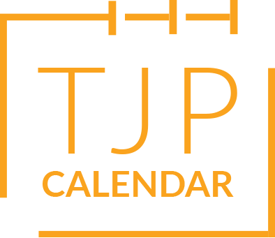

# Calendar-SPA

WELCOME TO THE CALENDAR PROJECT!

# User Stories

### Profiles 
- As a site memeber, I want to personalize my calandar both in aesthetics and function. Being able to fill out my name and purpose for the calandar via pre defined text feields and free text field or two 
- I am able to differentiate between calandar types or event types allowing me to separate work/personal life events. Either through separate calandars or through style and colour choices. 
- I am able to send invites for events via email. 

### Calandars  
- As a site users, I can filter by year/month/day which will render a new view of the calandar condensing events into smaller information blocks. I am able to easily navigate between these from the home page.
- I am able to filter events by their type/description or colour allowing, this will be enabled as a drop down or selection tab that allows me to quickly do so without the need to log into or switch between accounts. 
- I am able to easily open each event without the need to navigate between pages, allowing me to easily view multiple events at a time. 

### Events
- I can set date/time/title/description/type for each event with the option to set a reoccuring event or one off. 
- Events are colour coded and will easily be distinguishable without the need to read the title or description. 

### Homepage:
- A navigation bar at the top of the page, with links to the different views (e.g. "Today", "Week", "Month") and options (e.g. "Add Event").
- A calendar view, showing the current day, week or month (depending on the selected view).
An event list, displaying the events for the selected date range.
- A footer with copyright information and additional links (e.g. "About", "Contact").

### Add Event form:
- A form for adding a new event, with fields for the event name, location and a description.
- A submit button to add the event to the calendar.

### Settings page:
- A submit button to save the changes.

# Technologies 

### Figma:

In the early stages of development we used Figma to draw up a series of designs/layouts which ensured we had a cohesive and uniform design. Peach with her background in graphic design was instrumental in guiding design decesions from start to finish.

Have a look -> [Figma Wireframes](https://www.figma.com/proto/VlU8Lfz12JcDVSlvU8nmqA/Untitled?page-id=0%3A1&node-id=4%3A317&viewport=255%2C170%2C0.14&scaling=scale-down&starting-point-node-id=1%3A85&show-proto-sidebar=1)

### Github Projects

Throughout our project, we co-ordinated our task delegation via the Github Projects native project management service. This helped ensure we had all neccassary information in one place and was remarkably simple to use. 

### Github

A project such as this would be near impossible without Gitbub's collaborative version control technology. Prior to the commencement of this project we had very little experience with collaborative coding. Despite the obsticles faced, It's clear we have all learned alot about the benefits of group based developement and testing. 

One of the most common struggles was avoiding merge conflicts when working on the same files. We countered this by implementing a more modularised approach in our file structure.

### Node.js:

Use Node.js and Express to handle HTTP requests and serve the webpage.
Use an SQL database to store the events and user settings.

### Javascript Date Functions 

It can be said that a majority of time during this project was dedicated to correctly understanding and implementing javascript date function in a way that displayed dates and times in a cohesive and easily readable format. We definately underestimated the complexity and specificity needed to correctly retrieve and display date information within the application. Our understanding of javascript dates as a whole has been greatly benefited via undertaking such a project.

# Bugs/Issues 

### FRONT END 

#### TIME ZONE
- The biggest struggle that all of us faced was the use of timezone/date objects, being able to get the data out of the new date function and parsing it into 
usable format was extremely difficult and hard to get consistent when each view is dealing with a different aspect. 
- We had to find workarounds for being in AEST where the date() provided UMT meaning we were always a day behind. 

#### DATES 
- As much as it sounds simple, matching up the day numbers to actual dates and days of the week was extremely difficult to get accurate, and working accross multiple months with different numbers of days.

#### RENDERING EVENTS 
- Rendering events in the correct spots requires the matching up of not just hours, but days, months and years. Attempting to get the calendar to re-render without including events from the previous month prooved difficult 

#### Design Consistency 
- Design consistency was difficult as we were all rendering out different view with differently named divs ect. Ultimately more collaboration would have enabled us to reuse code more effectively 

#### CSS 
- Positioning a high number of divs and having them render differently depending on the date. 
- Just CSS in general to be frank.

### Back End

#### Sessions
- Getting sessions to work in general was a challenge, but once set up was universally usable.

#### Scope
- We struggled to make variables that we were getting from the databases available to all views, leading to using more get requests than needed. Instead of doing one and then rendering that data to each view we used a get request per view. 

### Working collaboratively
- In hindsight there is a huge amount of code we could have shared and reused to keep consistency accross the board. Unfortunately working on separate views like we did caused use to have minor differences in our how code works that meant alot of the code was just not transferrable in the immediate. 
- Because we chose to work on separate views it lead to us believing that our code worked correctly, yet when combined with eachothers views there were big issues that stemmed from being no cohesion between how elements were created/designed/named. 

### GIT 
- Branches, worked smoothly until we needed to do a lot of work last minute which led to alot of conflicts and errors in the code once combined. 
- Found ourselves stuck a few times where we couldnt progress individually because we relied on eachothers PRs to continue working to avoid major merge conflicts.